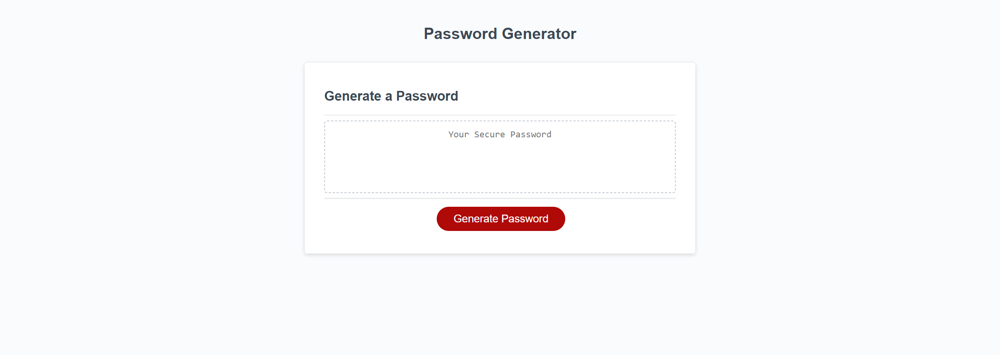

# Unique-Password-Generation

## Description
This application serves as a random password generator that will generate a radnom password based on criteria selected through prompts. These criteria consist of length between 8 - 128 characters, upper case letters, lower case letters, numbers and special characters. 

## Installation
N/A

## Usage
This application can be used to generate a random password for a secure unique password. 

## Credits
N/A

## License
MIT License

## Deployment
This Application is deployed on Github Pages

URL to deployed site: https://mparker96.github.io/Unique-Password-Generation/

